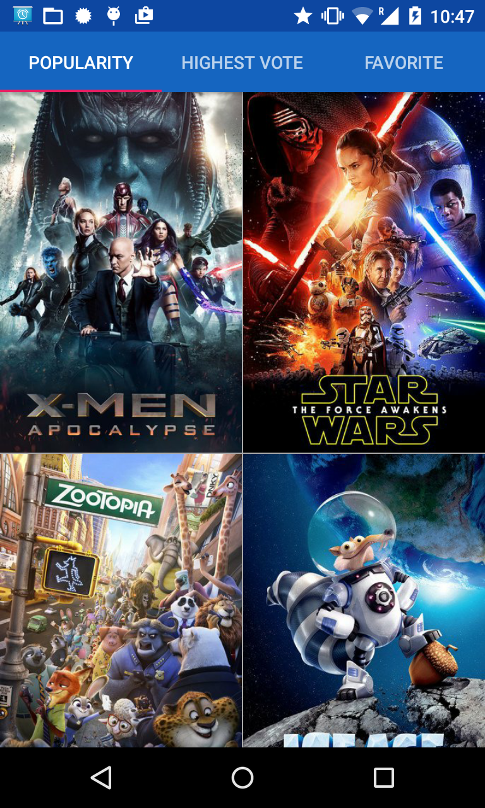
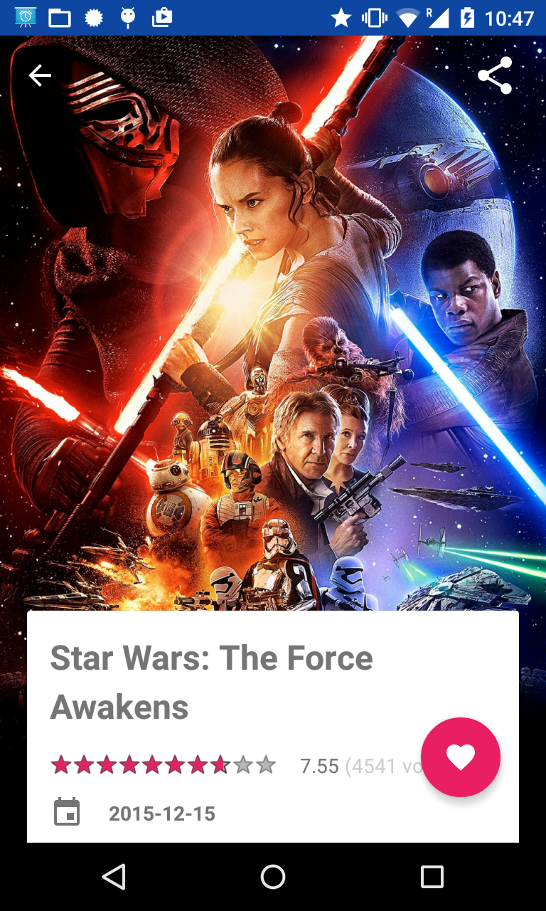
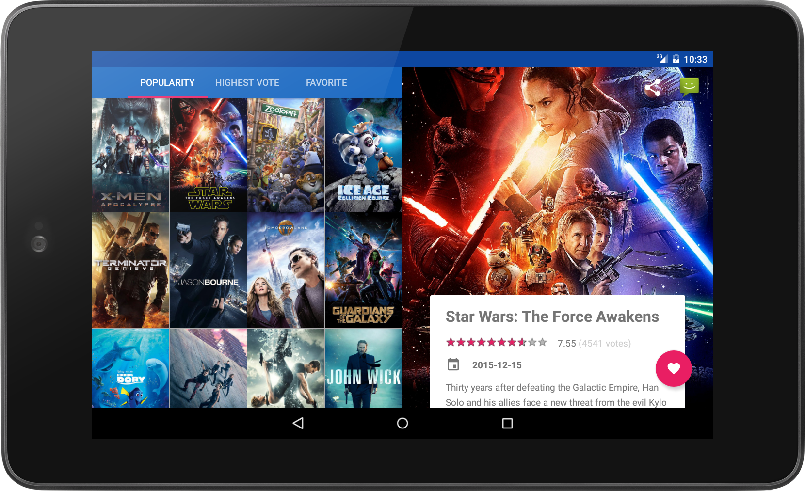

# Project 1-2: Popular Movies 

 This app will help you find popular movies by browsing through the most popular movies right now or highest rated movies according to TMDB.org. For each movie, you will find its rating, overview, user reviews, and also the movie trailers! Moreover, you can save into your Watchlist the movies that interest you. 

   

**Try it on Play Store:** 

## P1: Popular Movies, Stage 1

Build from scratch an app to retrive a list of movies from TMDB.org sorted by most popular or highest rated. The movies are displayed with poster image in grid view. Users can then select a movie to view the movie information in another screen. See [project description](https://github.com/udacity/Project-Descriptions-for-Review/blob/master/Android/Popular%20Movies%20Stage%201.md) for more detail.

**Skill required:** _GridView and ArrayAdapter, Picasso image library, AsyncTask, JSON Parsing, Activity life cycle and how to save/restore instance state, SettingActivity and SharedPreference_

## P2: Popular Movies, Stage 2

Add onto P1 the following features
* Support for 7-inch and 10-inch tablets with Master-Detail layout
* Ability to mark movies as favorite movies and save movies information for offline
* Retrieve and display user reviews and movie trailers from TMDB.org
* Ability to share movie trailer (a link to youtube video) to friends
* See [project description](https://github.com/udacity/Project-Descriptions-for-Review/blob/master/Android/Popular%20Movies%20Stage%202.md) for more detail.

**Skill required:** _Responsive UI, Resource Qualifier, Fragment, SQLite databases, Content Provider, ShareActionProvider_

## Extra Miles :sparkles:

The following improvements have been added into the project throughout my learning in modern Android development.

* Major improvement in UI/UX with Material Design
  * Swipe Views with Tabs to navigate between different movie lists
  * Immersive design with movie information on a card surface with full screen poster image in background
  * Meaningful animations according to Material Design principle, i.e. Shared element transition
* Endless scrolling through movies without pagination
* Accessibility for visual impair on all screen, tested with Google TalkBack ScreenReader
* Localization for Thai language including with Thai UI and Thai content from TMDB.org

**Skill required:** _Material Design, AppCompat, Design Support Library, Floating Action Button, CardView, Animation, Transition_

**Remark:** This application is Ratanachai's work for Udacity [Android Developer Nanodegree program](https://www.udacity.com/course/android-developer-nanodegree-by-google--nd801)
